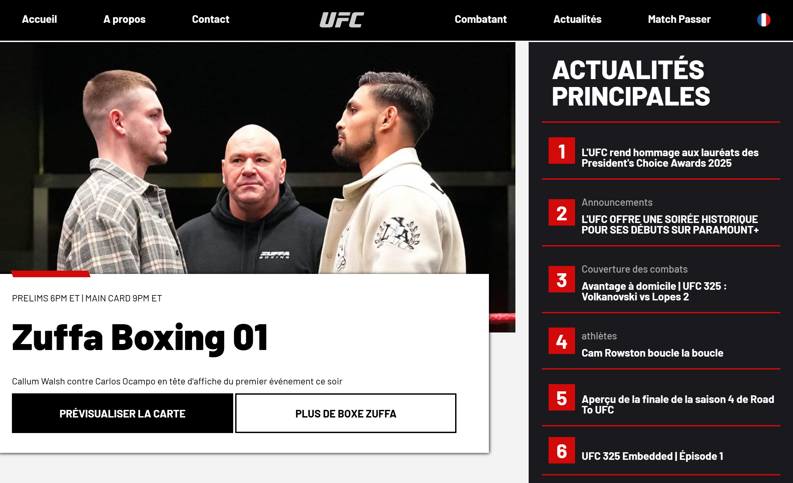
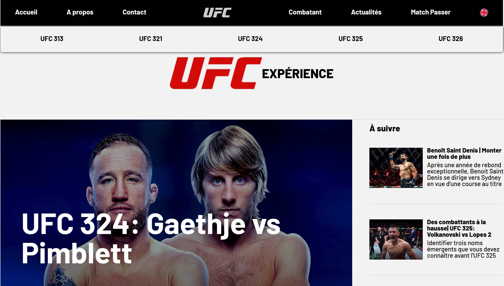

# 🥊 SAE 105 : Projet Web UFC (PHP & Twig)
**Une plateforme web dynamique développée de A à Z durant mon premier semestre de BUT MMI.**

---

## 📌 Présentation du projet
Ce projet était un défi de type "Sprint" : nous avions **6 jours** pour concevoir et développer un site web entièrement fonctionnel avant de le présenter devant un jury de professionnels. L'accent a été mis sur la séparation de la logique et de la présentation, ainsi que sur l'autonomie technique.

## 🛠️ Stack Technique
   

---

## 💡 Défis clés & Solutions

### 1. Adaptation rapide & Auto-formation (Twig)
Contrairement aux autres modules, nous n'avons reçu qu'une brève introduction et des directives minimales sur Twig.
* **Défi :** J'ai dû effectuer des recherches indépendantes pour comprendre la logique d'un nouveau moteur de template sous une échéance très courte.
* **Solution :** En moins de 24 heures, je suis passé d'une connaissance nulle à la maîtrise de l'**héritage de template** et de la **syntaxe**, démontrant une grande autonomie technique et une forte capacité d'apprentissage.

### 2. Optimisation du code (Principe DRY)
Le brief exigeait 3 pages statiques et 3 pages de catégories dynamiques.
* **Optimisation :** Au lieu de coder chaque page en dur, j'ai stocké toutes les données des catégories dans un **fichier de données PHP** centralisé.
* **Résultat :** J'ai utilisé des **boucles PHP** pour injecter les données dans les templates Twig, atteignant l'objectif de "faire plus avec moins de code".

### 3. Résolution de conflits UI/UX
J'ai implémenté un menu de navigation "sticky" personnalisé qui descend lors du scroll pour une meilleure accessibilité.
* **Problème :** L'obligation d'ajouter un menu déroulant créait un conflit visuel, car les menus déroulants masquaient une partie de mon menu collant personnalisé.
* **Solution logique :** J'ai mis en place une logique de **rendu conditionnel**. J'ai créé une condition spécifique pour que les menus déroulants ne s'affichent pas sur les pages où ils perturbaient l'expérience utilisateur (UX), garantissant une interface propre et professionnelle.

---

## 🚀 Acquis de l'apprentissage
* **Gestion des données :** Centralisation des informations répétitives dans des fichiers de données distincts pour améliorer la maintenance.
* **Gestion du temps :** Livraison d'un projet technique complexe sous un délai strict de 6 jours.
* **Prise de parole en public :** Défense des choix techniques et de l'architecture devant un jury.

---

## 📌 Présentation du projet
**Note : 20/20 (Major de promotion)** Voici un aperçu visuel du projet qui a obtenu la note parfaite de 20/20 :

| Desktop View - Home | Fighters Page | News Page |
| :---: | :---: | :---: |
|  |  |  |

---
*Note : Les captures d'écran illustrent l'interface finale présentée au jury. Ce dossier ne contient pas le « dossier vendor ».
Projet développé dans le cadre du programme BUT MMI (Métiers du Multimédia et de l'Internet).*
