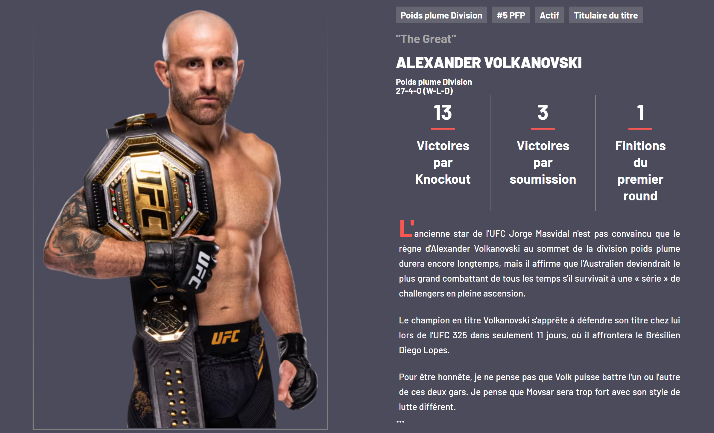

# 🥊 SAE 105: UFC Website Project (PHP & Twig)
**A dynamic web platform developed from scratch during my first semester of BUT MMI.**

## 📌 Project Overview
This project was a "Sprint" challenge: we had **6 days** to design and develop a fully functional website before presenting it to a jury of professionals. The focus was on separating logic from presentation and demonstrating technical autonomy.

## 🛠️ Tech Stack

## 💡 Key Challenges & Solutions

### 1. Rapid Adaptation & Self-Learning (Twig)
Unlike other modules, we received only a brief introduction and guidelines for Twig.
* **Challenge:** I had to independently research and understand the logic of a new templating engine under a tight deadline.
* **Solution:** Within 24 hours, I moved from zero knowledge to mastering **template inheritance** and **syntax**, demonstrating high technical autonomy and a fast learning curve.

### 2. Code Optimization (DRY Principle)
The brief required 3 static pages and 3 dynamic category pages.
* **Optimization:** Instead of hard-coding every page, I stored all categorical data in a central **PHP data file**.
* **Result:** I used **PHP loops** to inject data into Twig templates, achieving the objective of "less code, more functionality."

### 3. Solving UI/UX Conflicts
I implemented a custom "sticky" navigation menu that slides down as the user scrolls for better accessibility.
* **Problem:** A mandatory dropdown menu requirement created a visual conflict, as the dropdowns would hide parts of my custom sticky menu.
* **Logic Solution:** I implemented **conditional rendering** logic. I created a specific condition so that the dropdown menus are disabled on pages where they would interfere with the UX, ensuring a clean and professional interface.

## 🚀 Learning Outcomes
- **Data Management:** Centralizing repeating information into distinct data files to improve maintainability.
- **Time Management:** Delivering a complex technical project under a strict 6-day deadline.
- **Public Speaking:** Defending technical choices and architecture in front of a jury.

  
## 📌 Project Overview
**Grade: 20/20 (Top of Class)**
This project was a "Sprint" challenge...
---## 📸 Project Preview

Voici un aperçu visuel du projet qui a obtenu la note de 20/20 :

| Desktop View - Home | Category Page |
| :---: | :---: |
|  |  |

*Note : Les captures d'écran illustrent l'interface finale présentée au jury.*
*Developed as part of the BUT MMI (Multimedia & Internet) program.*
